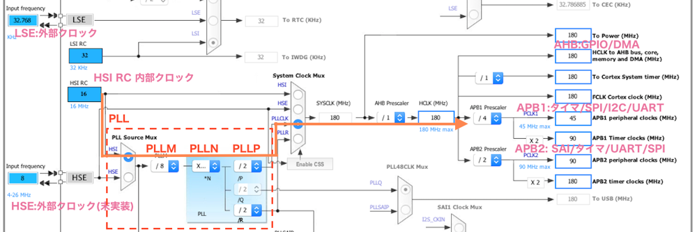

# STM32F446 のクロック設定 メモ

F446 のクロック校正図

RCC(Reset and Clock control) の項目のなかで､図のクロック設定を行っているレジスタは､とりあえず  
コントロールレジスタ CR  
PLL コンフィギュレーションレジスタ PLLCFGR  
クロックコンフィギュレーションレジスタ CFGR  
の 3 つがある｡それぞれについて｡  
RCC->CR は HSI RC(内部 8MHz)､HSE(外部 8MHz) の選択などが設定できる｡  
RCC->PLLCFGR は､PLL 内の､入力側から PLLM(分周)､PLLN(逓倍)､PLLP(分周)の比(など)を設定できる｡  
RCC->CFGR は､APB1､APB2､AHB へのクロック分周などの設定ができる｡  
Mbed のデフォルトは  
HSI RC(内部 8MHz)-> PLLM(1/8) ->(1MHz) -> PLLN(×360) -> (360MHz) -> PLLP(1/2) -> (180MHz) ->AHB  
となっている｡さらに APB1 への入力周波数は  
APB1 プリスケーラ RCC->CFGR->PPRE1(第 12-10bit))が 1/4 に設定されているので､180/4=45MHz となる｡  
なのでここに限って言えば､STM32Cube のデフォルト設定と同じである｡
